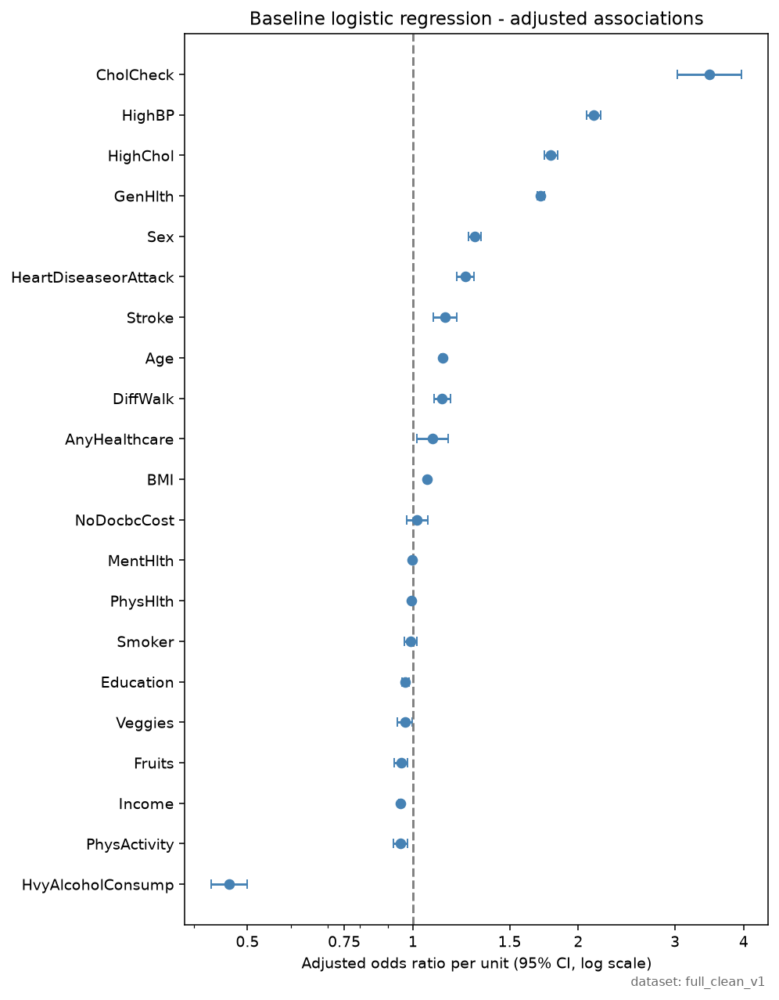
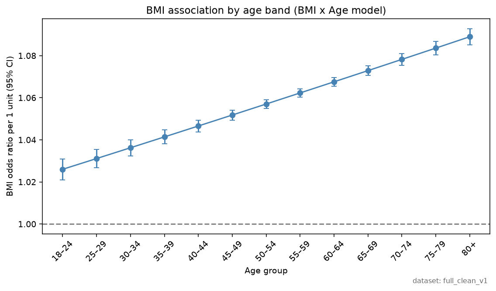
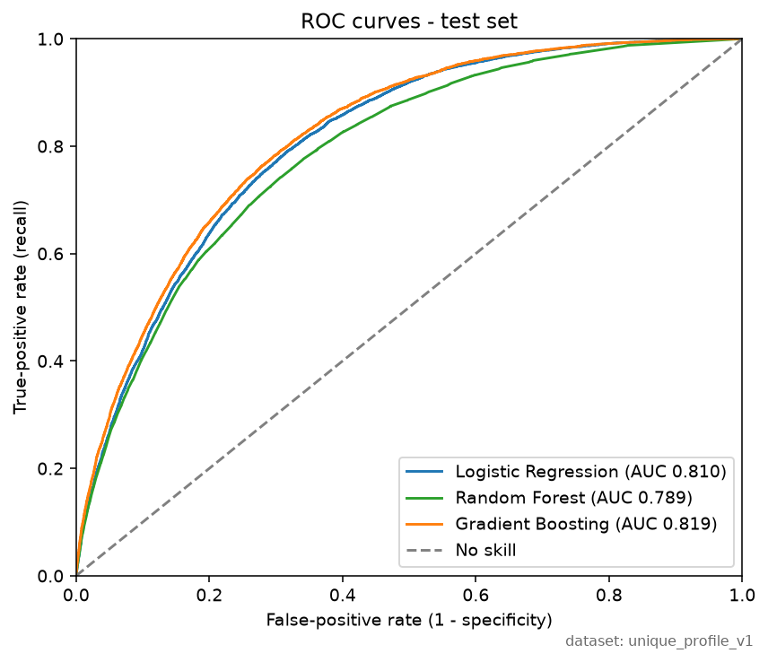
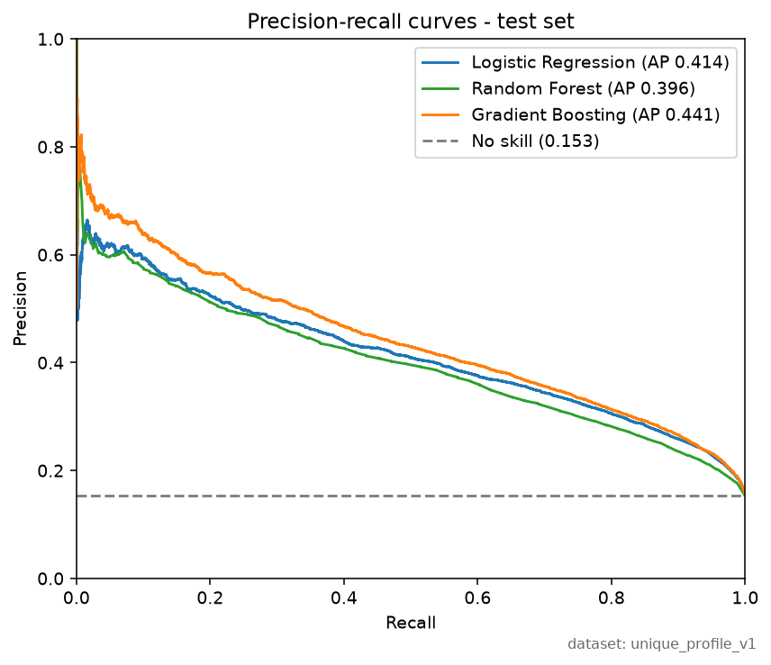
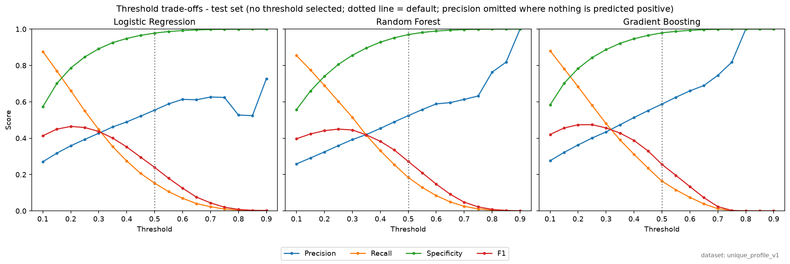
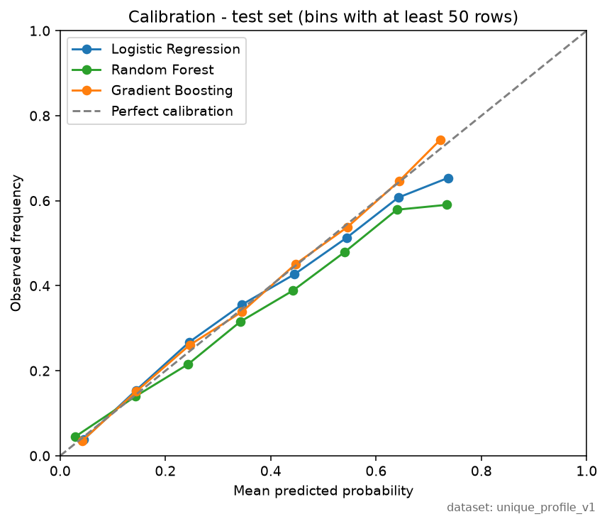
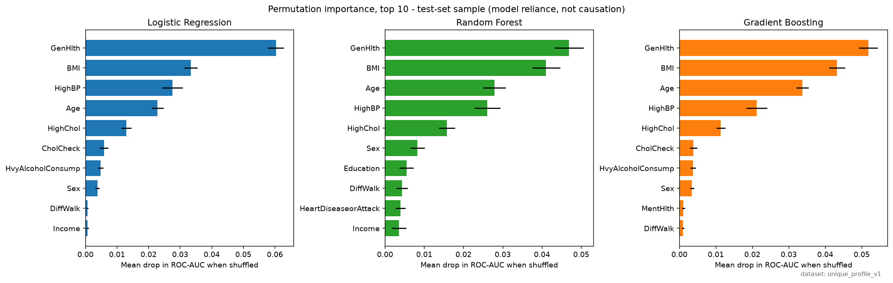

# Modeling report outline (Member 3)

Report outline for spec section 26 items 10–16 and the modeling limitations in
section 27. Every number comes from `outputs/` and can be regenerated with:

```text
python -m src.analysis.export_regression --csv data/raw/cdc_diabetes.csv
python -m src.analysis.export_modeling --csv data/raw/cdc_diabetes.csv
python -m src.analysis.export_duplicate_sensitivity --csv data/raw/cdc_diabetes.csv
```

Target code 1 is **prediabetes or diabetes** (project-defined outcome). All results
are associations in a self-reported survey sample; none are causal or diagnostic.

Four results need careful wording:

- **Heavy alcohol use appears protective** (odds ratio 0.46). This is an
  association, most likely confounding or reporting bias, not an effect.
- **CholCheck has the largest odds ratio** (3.47). The direction is probably
  reversed: people already diagnosed get their cholesterol checked.
- **Accuracy is uninformative.** Every model scores about 0.85, roughly what
  always predicting "no" would score.
- **Class weighting is equivalent to lowering the threshold.** It gives almost
  the same result as the original model with the threshold lowered to 0.15.

## Shared methods

- **Dataset variants.**
  - `full_clean_v1`: all 253,680 records, used for the regression.
  - `unique_profile_v1`: 229,474 rows after removing complete-row duplicates,
    used for machine learning.
- **ML split.** 80/20, stratified on the outcome and grouped by feature-vector
  hash so identical profiles never appear on both sides (`StratifiedGroupKFold`,
  seed 42).
  - 183,579 training rows and 45,895 test rows.
  - Leakage check: 0 profiles shared between train and test.
- **Test set use.** Evaluation only. No threshold or hyperparameter was chosen on it.
- **Preprocessing.** `StandardScaler` sits inside each model pipeline, so it is
  fitted on training data only.
- **Reproducibility.** Each export writes a manifest
  (`outputs/regression_manifest.json`, `outputs/modeling_manifest.json`).

## 10. Logistic regression (`full_clean_v1`, n = 253,680)

**Method.** statsmodels logistic regression on all 21 features.

- BMI and Age are centered at their means (28.38 and age code 8.03).
- Ordinal codes (GenHlth, Age, Education, Income) are treated as numeric scores.
- 95% confidence intervals. The model converged; pseudo-R² = 0.208.

**Use.** `outputs/tables/full_clean_v1_regression_baseline_odds_ratios.csv`



| Feature | OR | 95% CI | Unit |
|---|---|---|---|
| CholCheck | 3.47 | 3.03–3.97 | had a check vs not |
| HighBP | 2.13 | 2.07–2.20 | yes vs no |
| HighChol | 1.78 | 1.74–1.83 | yes vs no |
| GenHlth | 1.71 | 1.68–1.74 | per step worse (1–5) |
| Sex | 1.29 | 1.26–1.33 | male vs female |
| HeartDiseaseorAttack | 1.25 | 1.20–1.29 | yes vs no |
| Age | 1.13 | 1.13–1.14 | per 5-year band |
| BMI | 1.063 | 1.061–1.065 | per BMI point (≈1.36 per 5 points) |
| Income | 0.95 | 0.94–0.96 | per income category |
| PhysActivity | 0.95 | 0.92–0.98 | yes vs no |
| HvyAlcoholConsump | 0.46 | 0.43–0.50 | yes vs no |
| Smoker | 0.99 | 0.96–1.02 | CI includes 1 (p = 0.43) |
| NoDocbcCost | 1.02 | 0.97–1.07 | CI includes 1 (p = 0.44) |

**Points to make.**

- These are adjusted associations: each holds the other 20 features fixed.
- With n above 250,000 almost every p-value is tiny, so judge results by the size
  of the odds ratio and its interval.
- Odds ratios depend on units. Translate BMI to 5 points so it is meaningful.
- Cardiometabolic markers (blood pressure, cholesterol) and self-rated health have
  the largest associations, matching the EDA.

**Pitfalls.**

- **CholCheck.** Only 3.7% of respondents had no check, and 2.5% of them are
  positive vs 14.4% of everyone else. Diagnosed people are routinely checked, so
  the direction is probably reversed. Do not present it as a risk factor.
- **Heavy alcohol use.** The odds ratio is 0.46, and the rate is also low before
  adjustment (5.8% positive vs 14.4%). Likely explanations are confounding,
  under-reporting, and sick people cutting back on drinking. Do not call it
  protective.
- **Ordinal codes as numbers.** This assumes every step has the same effect on
  the log-odds.
- **No survey weights.** Results describe this sample, not the US population.

## 11. BMI × Age interaction (`full_clean_v1`)

**Method.** Baseline model plus a centered BMI × Age term, compared with a
likelihood-ratio test and AIC/BIC.

**Use.** `outputs/tables/full_clean_v1_regression_bmi_odds_by_age.csv` and
`outputs/tables/full_clean_v1_regression_model_comparison.csv`



- **Interaction term.** Coefficient 0.00497 (SE 0.00032); odds ratio 1.0050
  (95% CI 1.0043–1.0056).
- **Fit comparison.** Likelihood-ratio χ² = 253.4 on 1 df, p ≈ 5 × 10⁻⁵⁷. AIC
  falls by 251.4 and BIC by 240.9.
- **Pseudo-R².** Rises only from 0.2083 to 0.2095.

| Age group | BMI OR per point | 95% CI | Per 5 points |
|---|---|---|---|
| 18–24 | 1.026 | 1.021–1.031 | ≈1.14 |
| 40–44 | 1.047 | 1.044–1.049 | ≈1.26 |
| 60–64 | 1.068 | 1.066–1.070 | ≈1.39 |
| 80+ | 1.089 | 1.085–1.093 | ≈1.53 |

**Points to make.**

- The BMI association is clearly stronger in older age groups on the log-odds
  scale. Every age group's interval stays above 1.
- The interaction is decisively supported statistically but adds little
  explained variation. It is real but modest.

**Pitfalls.**

- An interaction on the log-odds scale is not the same as one on the probability
  scale. Say "on the odds scale".
- Age is in 5-year bands and treated as linear.
- `full_clean_v1` keeps repeated rows, which can make standard errors too small.
- The data are cross-sectional, so they say nothing about BMI change over a lifetime.

## 12. Machine-learning models (`unique_profile_v1`, test n = 45,895)

**Models.** Default scikit-learn hyperparameters, no tuning:

- logistic regression (lbfgs, up to 1,000 iterations);
- random forest (100 trees);
- gradient boosting (100 trees, depth 3).

**Use.** `outputs/tables/model_comparison.csv` and the confusion matrices from the
Machine Learning Lab page.





Test set, threshold 0.5:

| Model | ROC AUC | PR AUC | Brier | Recall | Precision | Specificity | F1 |
|---|---|---|---|---|---|---|---|
| Logistic regression | 0.810 | 0.414 | 0.107 | 0.153 | 0.554 | 0.978 | 0.239 |
| Random forest | 0.789 | 0.396 | 0.110 | 0.184 | 0.524 | 0.970 | 0.272 |
| Gradient boosting | 0.819 | 0.441 | 0.105 | 0.164 | 0.588 | 0.979 | 0.256 |

**Points to make.**

- **Accuracy says almost nothing here.** Test prevalence is 15.3%, so always
  predicting "no" scores 84.7%, and the models score 0.85. Use ROC AUC, PR AUC
  and Brier instead.
- **PR AUC beats chance.** The no-skill baseline is 0.153, so 0.41–0.44 is about
  2.7–2.9 times better.
- **Gradient boosting leads, but only slightly.** It is best on all three
  measures, just ahead of logistic regression (0.819 vs 0.810). The simpler,
  interpretable model is nearly as good.
- **The random forest is weakest despite being the most flexible.** Default
  unpruned trees tend to overfit.
- **Recall is low at 0.5.** Every model misses more than 80% of positives, which
  motivates sections 13 and 14.

**Pitfalls.**

- One split only, so there are no confidence intervals on the metrics. AUC
  differences of about 0.01 may not be meaningful.
- No hyperparameter tuning and no validation set.

## 12a. Duplicate-handling sensitivity (RQ13, H11)

Report this in section 4 (data quality and duplicates) or right after section 12.

**Design.** The three baselines are trained under four scenarios: two dataset
variants, each with two split types. Seed 42, 80/20 stratified, threshold 0.5,
and the same models as section 12.

- **Grouped split:** identical feature vectors stay on one side of the split.
- **Random split:** identical feature vectors can land in both train and test.

Comparing grouped with random on the same data isolates leakage. Comparing
`full_clean_v1` with `unique_profile_v1` under grouped splits isolates
deduplication.

**Use.** `outputs/tables/duplicate_sensitivity.csv` and
`outputs/duplicate_sensitivity_manifest.json`

**Duplicate structure** (from the data):

- `unique_profile_v1`: 1,566 feature vectors appear exactly twice, always once
  with each label, because complete-row deduplication removed same-label copies.
- `full_clean_v1`: 12,228 feature vectors repeat, covering 38,000 rows with up to
  59 copies of one profile. 94.9% of these rows are negative, so they are common
  low-risk profiles.

| Scenario | Variant | Split | Train | Test | Test prevalence | Test rows seen in training |
|---|---|---|---|---|---|---|
| Primary | `unique_profile_v1` | grouped | 183,579 | 45,895 | 15.3% | 0 |
| | `unique_profile_v1` | random | 183,579 | 45,895 | 15.3% | 502 (1.1%) |
| | `full_clean_v1` | grouped | 202,943 | 50,737 | 13.9% | 0 |
| | `full_clean_v1` | random | 202,944 | 50,736 | 13.9% | 6,836 (13.5%) |

ROC AUC / PR AUC / Brier on all test rows:

| Model | Unique, grouped (primary) | Unique, random | Full, grouped | Full, random |
|---|---|---|---|---|
| Logistic regression | 0.810 / 0.414 / 0.107 | 0.810 / 0.414 / 0.107 | 0.822 / 0.406 / 0.099 | 0.819 / 0.394 / 0.100 |
| Random forest | 0.790 / 0.396 / 0.110 | 0.778 / 0.358 / 0.114 | 0.804 / 0.389 / 0.101 | 0.796 / 0.369 / 0.104 |
| Gradient boosting | 0.819 / 0.441 / 0.105 | 0.819 / 0.446 / 0.105 | 0.831 / 0.434 / 0.096 | 0.826 / 0.421 / 0.098 |

**Points to make.**

- **Answer to H11:** duplicate handling does change evaluation results, mainly
  through which rows end up in the test set rather than through leakage.
- **Keeping duplicates flatters ranking and calibration scores.** Compare full
  with unique, both grouped:
  - ROC AUC rises by 0.012–0.014 for every model and Brier falls by about 0.009;
  - PR AUC falls by 0.007–0.009.

  The extra rows are mostly easy negatives, which also lower test prevalence
  (13.9% vs 15.3%). Neither change means a better model.
- **Letting identical vectors cross the split did not inflate the metrics here.**
  Comparing random with grouped on the same data, ROC AUC changed by −0.011 to
  +0.001.
  - The random forest lost the most (unique: 0.790 to 0.778).
  - In `unique_profile_v1` every crossing vector has the opposite label in
    training, so a model that memorizes it is wrong. The random forest scores
    ROC AUC 0.00 on those 502 rows; logistic regression and gradient boosting are
    near chance (0.53).
  - In `full_clean_v1` the crossing rows are mostly low-risk profiles (5.3%
    positive), which are easy to rank either way.
- **The grouped split remains the right design.** It is the only one in which
  the test set measures performance on profiles the model has never seen. The
  risk did not show up as optimism in this dataset, but a grouped split removes
  the question entirely.

**Pitfalls.**

- One seed and one split per scenario, so there are no confidence intervals. The
  split-type differences for logistic regression and gradient boosting (≤0.005
  AUC) are within sampling noise. The full-vs-unique difference is consistent
  across all three models.
- Seen and unseen test subsets differ in composition (5.3% vs 15.3% positive in
  the full random split), so comparing their metrics does not measure "leakage
  gain".
- This is a sensitivity analysis. The primary results in sections 12–16 use only
  the grouped `unique_profile_v1` scenario.

## 13. Class-imbalance experiments (logistic regression)

**Setup.**

- Training data: 155,501 negatives and 28,078 positives (15.3% positive).
- Strategies: original, class-weighted (`"balanced"`), and random undersampling
  of negatives to 28,078 each.
- Only the training data changes; every strategy is scored on the same untouched
  test set.

**Use.** `outputs/tables/imbalance_experiments.csv` and the Imbalance & Threshold
Lab chart.

| Strategy | Recall | Precision | Specificity | F1 | ROC AUC | Brier |
|---|---|---|---|---|---|---|
| Original | 0.153 | 0.554 | 0.978 | 0.239 | 0.810 | 0.107 |
| Class-weighted | 0.762 | 0.322 | 0.711 | 0.453 | 0.810 | 0.184 |
| Undersampling | 0.762 | 0.322 | 0.710 | 0.452 | 0.810 | 0.184 |

**Points to make.**

- **Rebalancing does not improve ranking.** ROC AUC stays at 0.810. It shifts
  the effective threshold: recall rises from 0.15 to 0.76 and precision falls
  from 0.55 to 0.32.
- **A lower threshold does the same.** The original model at threshold 0.15 gives
  recall 0.770 and precision 0.318, nearly identical to class weighting at 0.5,
  without retraining or distorting probabilities.
- **Probabilities get worse.** Brier rises from 0.107 to 0.184 because rebalancing
  inflates predicted probabilities. Do not read these outputs as real-world
  probabilities.
- **Undersampling wastes data.** It matches class weighting while discarding
  127,423 negative rows, so class weighting is the more efficient choice.

**Pitfalls.**

- Only logistic regression was tested; scikit-learn's gradient boosting has no
  `class_weight` option.
- Each strategy was run once, with seed 42.

## 14. Threshold analysis (all three models, test set)

**Setup.** Thresholds from 0.10 to 0.90 in steps of 0.05, reported as a
trade-off. **No threshold is selected**, because choosing one on the test set
would bias the reported results.

**Use.** `outputs/tables/thresholds_analysis_*.csv`



| Threshold | LR recall / precision | GB recall / precision | RF recall / precision |
|---|---|---|---|
| 0.10 | 0.876 / 0.270 | 0.880 / 0.276 | 0.854 / 0.258 |
| 0.20 | 0.661 / 0.358 | 0.683 / 0.363 | 0.689 / 0.325 |
| 0.30 | 0.447 / 0.427 | 0.480 / 0.435 | 0.514 / 0.392 |
| 0.50 | 0.153 / 0.554 | 0.164 / 0.588 | 0.184 / 0.524 |

**Points to make.**

- **0.5 is a poor default when positives are 15%.**
- **F1 peaks well below 0.5:**
  - logistic regression: 0.465 at 0.20;
  - gradient boosting: 0.474 at 0.20–0.25;
  - random forest: 0.450 at 0.25.
- **The right threshold depends on costs.** Screening favors recall and a low
  threshold; resource-limited follow-up favors precision.
- **High thresholds are unstable.** Above about 0.8 very few rows are flagged, so
  precision rests on small counts.

**Future work.** Choose the threshold on a validation set or by cross-validation,
then confirm it on the test set.

## 15. Calibration (test set, 10 equal-width bins)

**Use.** `outputs/tables/calibration_table_*.csv`; Brier and ECE values are in
`outputs/models/metrics.json`.



| Model | Brier | Expected calibration error |
|---|---|---|
| Gradient boosting | 0.1051 | 0.0074 |
| Logistic regression | 0.1075 | 0.0117 |
| Random forest | 0.1104 | 0.0213 |

**Points to make.**

- **Gradient boosting** follows the diagonal closely in every bin with enough
  data, up to about 0.7.
- **Logistic regression** is well calibrated below 0.4 and slightly overestimates
  above it (0.64 predicted vs 0.61 observed in the 0.6–0.7 bin).
- **Random forest** overestimates from about 0.4 upward (0.73 predicted vs 0.59
  observed in the 0.7–0.8 bin) and underestimates in the lowest bin (0.029 vs 0.045).
- **The low-risk range dominates.** About half of test rows fall in the 0–0.1 bin,
  so the overall scores mostly reflect that range.
- **Discrimination and calibration are separate properties.** Rebalanced models
  rank just as well but are miscalibrated (section 13).

**Pitfalls.**

- Bins with fewer than 50 test rows are hidden in the app, for example the 44 rows
  in logistic regression's 0.8–0.9 bin. Do not interpret them.
- Calibration is specific to this sample and can shift in another population.

## 16. Model interpretation

**Method.**

- Permutation importance: the mean drop in ROC AUC over 10 shuffles of each
  feature, on 10,000 test rows.
- The regression odds ratios from section 10 provide a second view.

**Use.** `outputs/tables/feature_importance_*.csv` and the rank table on the
Interpretation page.



| Rank | Logistic regression | Random forest | Gradient boosting |
|---|---|---|---|
| 1 | GenHlth (0.060) | GenHlth (0.047) | GenHlth (0.052) |
| 2 | BMI (0.033) | BMI (0.041) | BMI (0.043) |
| 3 | HighBP (0.028) | Age (0.028) | Age (0.034) |
| 4 | Age (0.023) | HighBP (0.026) | HighBP (0.021) |
| 5 | HighChol (0.013) | HighChol (0.016) | HighChol (0.011) |

**Points to make.**

- **The models agree.** All three share the same top five features, which are
  also the strongest regression associations, so the findings hold across methods.
- **Importance and odds ratios measure different things.**
  - CholCheck has the largest odds ratio but low importance: only 3.7% of people
    lack a check, so shuffling it barely changes the ranking.
  - Heavy alcohol use is similar (5.6% of people).
  - Importance reflects how much a feature helps rank people; the odds ratio
    reflects its association per unit.

**Pitfalls.**

- Correlated features share credit. GenHlth, PhysHlth and DiffWalk overlap, so
  each can look less important than it is.
- Importance is predictive usefulness for this model, not causation.
- It is computed on a 10,000-row sample of the test set.

## 17. Limitations (modeling)

**From spec section 27:**

- **(5–6)** Duplicate feature rows cannot be confirmed as the same person, and
  removing them for ML is an analytical choice.
- **(7)** Predictive performance does not establish clinical usefulness or
  generalizability.
- **(8)** The threshold choice depends on context.
- **(9)** Calibration and discrimination can change in other populations.

**Modeling-specific:**

- One train/test split, so the metrics have no confidence intervals.
- No hyperparameter tuning and no validation set.
- Imbalance experiments cover logistic regression only.
- Ordinal codes are assumed linear on the log-odds scale.
- Survey weights are not used, and self-reported features carry measurement error.

**Prediction Explorer:**

- 13 of the 21 inputs default to the most common training values.
- Education and Income default to their top categories, which lowers the
  estimates.
- The output is a model estimate, not a diagnosis.

## Figure captions

Each caption must name its dataset variant, for example:

> Figure X. ROC curves for three classifiers on the held-out test set
> (`unique_profile_v1`, n = 45,895).
>
> Figure Y. Odds ratio per 1-unit BMI increase by age group, from the BMI × Age
> interaction model (`full_clean_v1`, n = 253,680).
